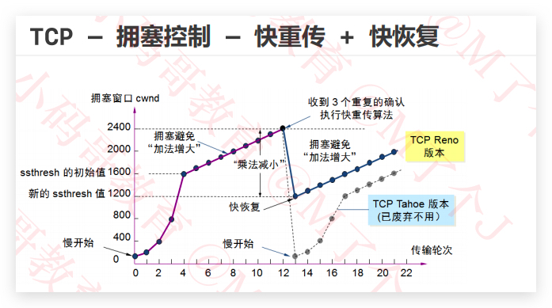

### 传输层、运输层 Transport
传输层有2个协议
TCP（Transmission Control Protocol），传输控制协议
UDP（User Datagram Protocol），用户数据报协议

|  | TCP | UDP |
|----------|------------|----------|
| 连接性 |面向连接  | 无连接 |
| 可靠性 | 可靠传输、不丢包 | 不可靠、尽最大努力交付，可能丢包 |
| 首部占用空间 | 大 | 小 |
| 传输速率 |慢 | 快 |
| 资源消耗 |大 | 小 |
| 应用场合 |浏览器、文件传输（FTP）、邮件发送（SMTP、POP3） | 音视频通话、直播、实时的 |
| 应用层协议 |HTTP、HTTPS、FTP、SMTP、DNS | DNS |
### UDP
UDP是无连接的，减少了建立和释放连接的开销
UDP尽最大能力交付，不保证可靠交付
因此不需要维护一些复杂的参数，首部只有8个字节（TCP的首部至少20个字节）

##### UDP长度 占16位
所有的长度包括数据  首部的长度 + 数据的长度
##### 检验和(Checksum)
检验和的计算内容：伪首部 + 首部 + 数据
伪首部：仅在计算检验和时起作用，并不会传递给网络层

##### 端口（源端口号 目标端口号）
- UDP首部中端口是占用2字节，可以推测出端口号的取值范围是：0~65535
- 客户端的源端口是临时开启的随机端口
- 防火墙可以设置开启\关闭某些端口来提高安全性,客户端可以通过https发给server，server在访问MySQL
- 针对服务器的端口

| 协议 | 默认端口号 |
|----------|------------|
| HTTP |TCP + 80 | 
| HTTS |TCP + 443 | 
| FTP |TCP + 21 | 
| MySQL |TCP + 3306 | 
| DNS |TCP/UDP + 53 | 
| SMTP |TCP + 25 | 
| POP3 |TCP + 110 | 

- 常用命令行
- netstat –an：查看被占用的端口
- netstat –anb：查看被占用的端口、占用端口的应用程序
- telnet 主机 端口：查看是否可以访问主机的某个端口
- 安装telnet：控制面板 – 程序 – 启用或关闭Windows功能 – 勾选“Telnet Client” – 确定

### TCP


##### TCP数据格式  数据偏移 占4位
- 取值范围是0x0101~0x1111，乘以4：用来计算首部长度
- 首部长度（Header Length）首部长度是20~60字节  5~15 和网络层首部差不多
##### TCP数据格式  保留 占6位 全为0
有些资料中，TCP首部的保留（Reserved）字段占3位，标志（Flags）字段占9位。Wireshark也是如此
##### TCP数据格式  标志位 占6位
这些标志都是传输层对传输层的一些回应
1. URG（Urgent）当URG=1时，紧急指针字段才有效。表明当前报文段中有紧急数据，应优先尽快传送。紧急指针中存放TCP的数据部分前几个字节紧急，存长度
2. ACK（Acknowledgment 确认）当ACK=1时，确认号字才有效
3. PSH（Push） 
4. RST（Reset）当RST=1时，表明连接中出现严重差错，必须释放连接，然后再重新建立连接
5. SYN（Synchronization 同步） 当SYN=1、ACK=0时，表明这是一个建立连接的请求;若对方同意建立连接，则回复SYN=1、ACK=1 建立连接使用
6. FIN（Finish） 当FIN=1时，表明数据已经发送完毕，要求释放连接 释放连接使用
##### TCP数据格式  序号（Sequence Number）  占4个字节 
TCP面向字节流 首先，在传输过程的每一个字节都会有一个编号，
在建立连接后，序号代表：这一次传给对方的TCP数据部分的第一个字节的编号
##### TCP数据格式  确认号（Acknowledgment Number）  占4个字节 
在建立连接后，确认号代表：期望对方下一次传过来的TCP数据部分的第一个字节的编号
##### TCP数据格式  窗口（WIndow）  占2个字节 
这个字段有流量控制功能，用以告知对方下一次允许发送的数据大小（字节为单位）

 ##### TCP细节
UDP的首部中有个16位的字段记录了整个UDP报文段的长度（首部+数据）
但是，TCP的首部中仅仅有个4位的字段记录了TCP报文段的首部长度，并没有字段记录TCP报文段的数据长度
分析
UDP首部中占16位的长度字段是冗余的，纯粹是为了保证首部是32bit对齐

TCP\UDP的数据长度，完全可以由IP数据包的首部推测出来
传输层的数据长度 = 网络层的总长度 – 网络层的首部长度 – 传输层的首部长度

##### TCP数据格式  检验和
跟UDP一样，TCP检验和的计算内容：伪首部 + 首部 + 数据
伪首部：占用12字节，仅在计算检验和时起作用，并不会传递给网络层

### TCP可靠传输 发现丢掉的包给你重发

##### TCP可靠传输 - 停止等待ARQ协议
效率低，一个一个发，不收到确认，死活不进行下一个
##### TCP可靠传输 - 连续ARQ协议 + 滑动窗口协议
发送方一起发4个（这4个是连续的），接收方 一口气发一个确认，发送方接着发第5个 
接收方来确定 窗口大小 
##### TCP可靠传输 - 可靠传输 （SACK选择性确认）
- 头部Options中记录左边界右边届
- 发过的不会重新发。
- 在TCP通信过程中，如果发送序列中间某个数据包丢失（比如1、2、3、4、5中的3丢失了）
TCP会通过重传最后确认的分组后续的分组（最后确认的是2，会重传3、4、5） 
这样原先已经正确传输的分组也可能重复发送（比如4、5），降低了TCP性能
- 为改善上述情况，发展出了SACK（Selective acknowledgment，选择性确认）技术
告诉发送方哪些数据丢失，哪些数据已经提前收到
使TCP只重新发送丢失的包（比如3），不用发送后续所有的分组（比如4、5）

SACK信息会放在TCP首部的选项部分  
Kind：占1字节。值为5代表这是SACK选项
Length：占1字节。表明SACK选项一共占用多少字节
Left Edge：占4字节，左边界
Right Edge：占4字节，右边界

一对边界信息需要占用8字节，由于TCP首部的选项部分最多40字节，所以
SACK选项最多携带4组边界信息
SACK选项的最大占用字节数 = 4 * 8(LeftEdge + RightEdge) + 2（Length Kind） = 34

Seq 序号 包的第一个字节的序号 
标志位ACK = 1  确认号:ack,ACK=1，确认号才有效想要的数据的第一个字节的序号

建立连接时有一个序号

##### 疑问
- 若有个包重传了N次还是失败，会一直持续重传到成功为止么？
这个取决于系统的设置，比如有些系统，重传5次还未成功就会发送reset报文（RST）断开TCP连接
超过一定的重传次数或者时间，还未收到来自对端的确认报文，于是发送reset报文。
- 接收方有400K，但是发送方只发送200K，接收方会等待看有没有第三个包，稍后会发送确认
##### 思考一个问题
- 为什么选择在传输层就将数据“大卸八块”分成多个段，而不是等到网络层再分片传递给数据链路层？
因为可以提高重传的性能（网络层、数据链路层没有重传功能。只是打包、分到下一层）
如果在传输层不分段，一旦出现数据丢失，整个传输层的数据都得重传，缺失后 接收方传输层收不到完整的文件
如果在传输层分了段，一旦出现数据丢失，只需要重传丢失的那些段即可
### TCP流量控制（我告诉你窗口多少 你告诉我窗口多少 点对点 ）
接收窗口是动态调整的，接收方在接收消息前需要先告诉发送方自己的窗口大小
既有接收窗口又有发送窗口，发送窗口不要大于接收窗口
- 如果接收方的缓存区满了，发送方还在疯狂着发送数据
1.接收方只能把收到的数据包丢掉，大量的丢包会极大着浪费网络资源
2.所以要进行流量控制
- 什么是流量控制？
1.让发送方的发送速率不要太快，让接收方来得及接收处理
- 原理
1.通过确认报文中窗口字段来控制发送方的发送速率
2.发送方的发送窗口大小不能超过接收方给出窗口大小
3.当发送方收到接收窗口的大小为0时，发送方就会停止发送数据

##### TCP流量控制-特殊情况
- 有一种特殊情况
1.一开始，接收方给发送方发送了0窗口的报文段
2.后面，接收方又有了一些存储空间，给发送方发送的非0窗口的报文段丢失了发送方的发送窗口一直为零，双方陷入僵局
- 解决方案
1.当发送方收到0窗口通知时，这时发送方停止发送报文
2.并且同时开启一个定时器，隔一段时间就发个测试报文去询问接收方最新的窗口大小
3.如果接收的窗口大小还是为0，则发送方再次刷新启动定时器
### TCP拥塞控制（在流量控制基础上，全网一起维护）
- 拥塞控制
防止过多的数据注入到网络中
避免网络中的路由器或链路过载
- 拥塞控制是一个全局性的过程
涉及到所有的主机、路由器
以及与降低网络传输性能有关的所有因素
是大家共同努力的结果
   相比而言，流量控制是点对点通信的控制

##### TCP - 拥塞控制 -方法
- 慢开始
- 拥塞避免（congestion avoidance）
- 快速重传（fast retransmit）
- 快速恢复（fast recovery）
- MSS（Maximum Segment Size）：每个段最大的数据部分大小，建立连接时确定，数据发送过程时没有了。SYN 头部 Options，接收方与发送方可能不一样，取两者最小值，协商。
- cwnd（congestion window）：拥塞窗口
- rwnd（receive window）：接收窗口 
- swnd（send window）：发送窗口 = min(cwnd, rwnd)
##### TCP - 拥塞控制 -慢开始
慢开始（slow start，慢启动）cwnd的初始值比较小，然后随着数据包被接收方确认（收到一个ACK） cwnd就成倍增长（指数级）
##### TCP - 拥塞控制 -拥塞避免（congestion avoidance）
1.ssthresh（slow start threshold），慢开始阈值；cwnd达到慢开始阈值(ssthresh)后，,以线性方式增加。
2.拥塞避免（加法增大）：拥塞窗口缓慢增大，以防止网络过早出现拥塞
3.乘法减小：只要网络出现拥塞，把ssthresh减为拥塞峰值的一半，同时执行慢开始算法（cwnd又恢复到初始值）
4.当网络出现频繁拥塞时，ssthresh值就下降的很快

##### TCP - 拥塞控制 -快速重传（fast retransmit）
如果没有快重传，会有超时重传，快速重传就会催一下。
- 接收方
1.每收到一个失序的分组后就立即发出重复确认
2.使发送方及时知道有分组没有到达
3.而不要等待自己发送数据时才进行确认
- 发送方
1.只要连续收到三个重复确认（总共4个相同的确认），就应当立即重传对方尚未收到的报文段
2.而不必继续等待重传计时器到期后再重传
##### TCP - 拥塞控制 -快恢复

1.当发送方连续收到三个重复确认，说明网络出现拥塞，就执行“乘法减小”算法，把ssthresh减为拥塞峰值的一半

2.与慢开始不同之处是现在不执行慢开始算法，即cwnd现在不恢复到初始值，而是把cwnd值设置为新的ssthresh值（减小后的值）然后开始执行拥塞避免算法（“加法增大”），使拥塞窗口缓慢地线性增大

##### TCP - 拥塞控制 -发送窗口的最大值
发送窗口的最大值：swnd = min(cwnd, rwnd)
当rwnd < cwnd时，是接收方的接收能力限制发送窗口的最大值
当cwnd < rwnd时，则是网络的拥塞限制发送窗口的最大值

### 连接管理（建立、释放）
发送HTTP请求之前，需要建立TCP连接。 三次握手
Client -> Server SYN 
Server -> Client SYN ACK
CLient -> Server ACK

### 08.TCP01_可靠传输
### 09.TCP02_流量控制_拥塞控制
### 10.TCP03_序号_确认号_建立连接
### 11.TCP04_释放连接
### 12.socket补充_域名
### 13.DNS_DHCP_HTTP
### 14.ABNF_请求头_响应头
### 15.状态码_form提交
### 16.跨域_Cookie_Session
### 17.代理_CDN_网络安全
### 18.加密_数字签名_证书
### 19.HTTPS
### 20.SPDY_QUIC_HTTP2_HTTP3
### 21.WS_HTTPDNS_FTP_邮件
### 22.IPv6_流媒体_即时通讯_缓存