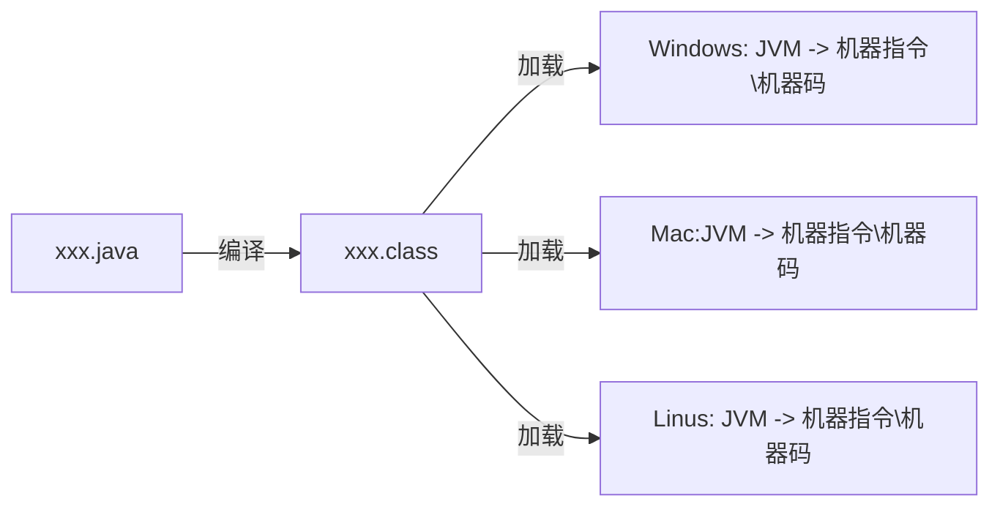
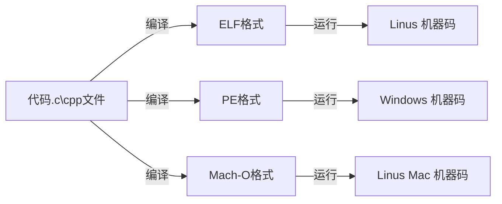

### 第一节
##### Java 的跨平台原理
- JVM => Java虚拟机
- Java的跨平台：一次编译，到处运行

编译生成跟平台无关的字节码文件(xxx.class文件)
由对应平台的JVM解析字节码为机器指令
- [JDK](https://www.oracle.com/java/technologies/javase-downloads.html) 需要安装JDK(内部包括JVM) 
- [Tomcat](https://tomcat.apache.org) 服务器软件
- [IntelliJ IDEA Ultimate](https://www.jetbrains.com/idea/download/#section=mac)类似编译性语言   
##### C、C++的垮平台原理：
- 使用各个平台的编译器生成对应平台的可执行文件

- 服务器端口:移动营业厅的柜台
- 服务器的一个端口可能部署许多项目;80端口=>qq ,微信;8080端口 => 王者、qq 

- 客服端发送消息给服务器  http://ip地址:端口号/项目名   
http://10/10/128.45:8080/qq/img/1.png    
http://10/10/128.45:8080/qq/img/login? para 发送参数   
服务器也是计算机，可以通过ip地址找到服务器，再找到端口,再找到项目，再找到项目下的文件
127.0.0.1回环地址  和localhost => 自己的ip地址
Application context 资源路径
##### 什么是协议？
面向协议编程，约束双方行为，减少双方沟通成本
 
##### OSI参考模型
应用层 表示层 会话层 运输层 网络层 数据链路层 物理层

##### TCP/IP协议
应用层 运输层 网络(际)层 网络接口层

##### 学习研究
应用层 运输层 网络(际)层 数据链路层 物理层

##### 请求过程

客户端(从应用层=>物理层) => 通过传输介质(无线网，网线) => 服务端(从物理层=>应用层) => 端口 TomCat 
如果服务端向客服端发送消息也是必须通过物理层，发送端(从应用层=>物理层)，接收端(从物理层=>应用层)

### 第二节
HTML CSS JS 基础
搭建Java服务器开发环境
请求参数 响应参数
网络中的额一些基本概念
##### 计算机之间的通信基础
1.需要知道对方的IP地址
2.最终是根据MAC地址(网卡地址)，输送数据到网卡，被网卡接收
如果网卡发现数据的目标MAC地址是自己，就会将数据传递给上一层处理
如果网卡发现数据的目标MAC地址不是自己，就会讲数据丢弃，不会传递给上一层进行处理

##### 计算机之间的连接方式 

目标MAC地址 目标IP地址 源MAC地址 源IP地址
- 网线直连 
ARP 协议也是有缓存的，问别人MAC地址是啥，广播，和我连着的我都发出去 在同一个网段中传播不同网段隔绝广播
ICMP 先通过ARP,获取MAC地址,只有IP地址不能够传递,再通过ICMP传输.
MAC地址 FFFFFFFF 表示广播 谁都能收到
不同设备之间连接 => 直通线  相同设备之间连接 => 交叉线
- 同轴电缆Coaxial
半双工通信:我发你时,你不能发给我,容易冲突,到处去发不安全 中间断掉网全部瘫掉 需要相同网段
- 集线器Hub
半双工通信 容易冲突 不安全 没有智商 比同轴电缆强在一个断了，别的不会瘫全部瘫掉 需要相同网段
可以理解成把大家连在一起，同轴电缆升级版
- 网桥 Network Bridge
也是连接同一个网段，通过自学习得知每个接口那侧的Mac地址 从而起到隔绝冲突域的作用，每个冲突域可以在各自同时通信
比较智能有学习能力
- 交换机Switch 局域网的最终方案
相等于接口更多的网桥
全双工通信(我发的时候你也可以发) 比集线器安全 有学习能力 一开始也是广播，后来学习了。
如果全球的设备都用交换机，IP会不够用，交换机在没有记录Mac地址前会广播，所以全球都是广播。
- 路由器Router
网线直连、同轴电缆、集线器、网桥、交换机都需要在同一网段，处在同一广播域
路由器可以在不同网段之间转发数据，隔绝广播域

光猫:调制解调器 光电信号转换
蓝牙：无限通信的网络标准 回环地址不需要网卡