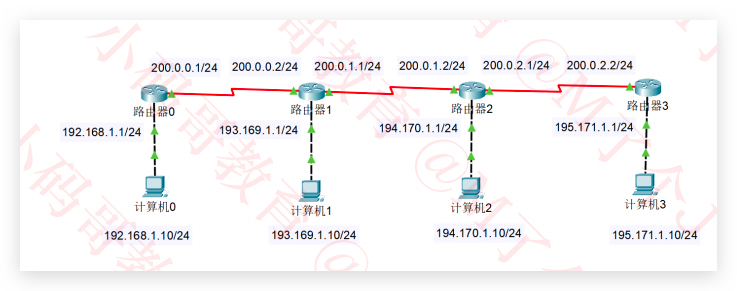
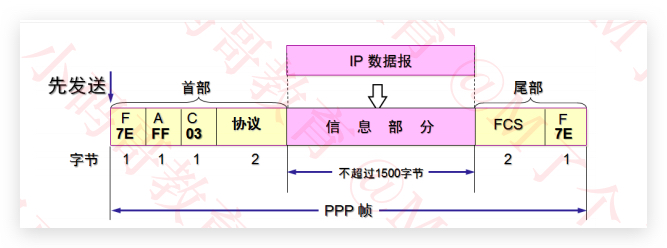

### 01.基本概念
##### Java 的跨平台原理
- JVM => Java虚拟机
- Java的跨平台：一次编译，到处运行

编译生成跟平台无关的字节码文件(xxx.class文件)
由对应平台的JVM解析字节码为机器指令
- [JDK](https://www.oracle.com/java/technologies/javase-downloads.html) 需要安装JDK(内部包括JVM) 
- [Tomcat](https://tomcat.apache.org) 服务器软件
- [IntelliJ IDEA Ultimate](https://www.jetbrains.com/idea/download/#section=mac)类似编译性语言   
##### C、C++的垮平台原理：
- 使用各个平台的编译器生成对应平台的可执行文件

- 服务器端口:移动营业厅的柜台
- 服务器的一个端口可能部署许多项目;80端口=>qq ,微信;8080端口 => 王者、qq 

- 客服端发送消息给服务器  http://ip地址:端口号/项目名   
http://10/10/128.45:8080/qq/img/1.png    
http://10/10/128.45:8080/qq/img/login? para 发送参数   
服务器也是计算机，可以通过ip地址找到服务器，再找到端口,再找到项目，再找到项目下的文件
127.0.0.1回环地址  和localhost => 自己的ip地址
Application context 资源路径
##### 什么是协议？
面向协议编程，约束双方行为，减少双方沟通成本
 
##### OSI参考模型
应用层 表示层 会话层 运输层 网络层 数据链路层 物理层

##### TCP/IP协议
应用层 运输层 网络(际)层 网络接口层

##### 学习研究
应用层 运输层 网络(际)层 数据链路层 物理层

##### 请求过程

客户端(从应用层=>物理层) => 通过传输介质(无线网，网线) => 服务端(从物理层=>应用层) => 端口 TomCat 
如果服务端向客服端发送消息也是必须通过物理层，发送端(从应用层=>物理层)，接收端(从物理层=>应用层)

### 02.集线器_网桥_交换机
HTML CSS JS 基础
搭建Java服务器开发环境
请求参数 响应参数
网络中的额一些基本概念
##### 计算机之间的通信基础
1.需要知道对方的IP地址
2.最终是根据MAC地址(网卡地址)，输送数据到网卡，被网卡接收
如果网卡发现数据的目标MAC地址是自己，就会将数据传递给上一层处理
如果网卡发现数据的目标MAC地址不是自己，就会讲数据丢弃，不会传递给上一层进行处理

##### 计算机之间的连接方式 

目标MAC地址 目标IP地址 源MAC地址 源IP地址
- 网线直连 
ARP 协议也是有缓存的，问别人MAC地址是啥，广播，和我连着的我都发出去 在同一个网段中传播不同网段隔绝广播
ICMP 先通过ARP,获取MAC地址,只有IP地址不能够传递,再通过ICMP传输.
MAC地址 FFFFFFFF 表示广播 谁都能收到
不同设备之间连接 => 直通线  相同设备之间连接 => 交叉线
- 同轴电缆Coaxial
半双工通信:我发你时,你不能发给我,容易冲突,到处去发不安全 中间断掉网全部瘫掉 需要相同网段
- 集线器Hub
半双工通信 容易冲突 不安全 没有智商 比同轴电缆强在一个断了，别的不会瘫全部瘫掉 需要相同网段
可以理解成把大家连在一起，同轴电缆升级版
- 网桥 Network Bridge
也是连接同一个网段，通过自学习得知每个接口那侧的Mac地址 从而起到隔绝冲突域的作用，每个冲突域可以在各自同时通信
比较智能有学习能力
- 交换机Switch 局域网的最终方案
相等于接口更多的网桥
全双工通信(我发的时候你也可以发) 比集线器安全 有学习能力 一开始也是广播，后来学习了。
如果全球的设备都用交换机，IP会不够用，交换机在没有记录Mac地址前会广播，所以全球都是广播,会产生广播风暴。
### 03.MAC地址_IP地址_子网掩码
- 路由器Router
网线直连、同轴电缆、集线器、网桥、交换机都需要在同一网段，处在同一广播域
路由器可以在不同网段之间转发数据，其余连接方式都不可以。隔绝广播域
路由器作用：在不同网段之间传输数据
光猫:调制解调器 光电信号转换
蓝牙:无线通信的网络标准;
回环地址不需要网卡

```
//192.168.1 大家在一个网段、广播域 后面的10,11,12是主机id
192.168.1.10 
192.168.1.11
192.168.1.12
```
主机发数据之前，首先会判断目标主机的IP地址跟他是否在同一个网段
- 同一个网段ARP 通过交换机、集线器传递数据
- 不在同一个网段：通过路由器转发数据，跨网段转发需要网关。将网关的ip地址设置成与其他设备相同的网段。(路由配置网关 192.168.1.1，自己家路由通过网关跨网段连接因特网)
- 网关(Gateway有Mac地址 IP地址) 跨网段先发给路由器的网关 
### MAC地址 网卡
每个网卡都有一个6个字节的MAC地址 
全球唯一，固化在网卡的ROM种，有IEEE802标准制定
前3个字节 组织唯一标识符 40-55-82 //厂家
后3个字节 网络接口标识符 0A-8C-6D 
[OUI列表](https://standards-oui.ieee.org/oui/oui.txt)
[OUI查询](https://mac.bmcx.com/)
当48位全是1时 FF-FF-FF-FF-FF-FF表示广播的地址
##### MAC地址获取
当不知对方主机的MAC地址时，可以通过发送ARP广播获取对方的MAC地址
获取成功后，会缓存IP地址、MAC地址的映射信息，缩成ARP缓存
通过ARP广播获取的MAC地址属于动态缓存，时效两分钟，之后就会删除。
arp -a [主机地址]：查询ARP缓存 主机地址 ip地址
arp -d [主机地址]：删除ARP缓存
arp -s 主机地址 MAC地址：增加一条缓存信息（这是静态缓存，存储时间较久，不同系统的存储时间不同）
##### ARP
- ARP(Address Resolution Protocol)地址解析协议
通过IP地址获取MAC地址
- RARP（Reverse Address Resolution Protocol)逆地址解析协议
使用与ARP相同的报头结构
作用与ARP相反，用于将MAC地址转换为IP地址
后来被BOOTP、DHCP所取代
#### IP地址
- IP地址（Internet Protocol Address）：互联网上的每一个主机都有一个IP地址。最初是IPv4版本，32bit（4个字节），2019年11月25日，全球的IP地址已经用完，后面推出了IPv6版本，128bit（16字节）

| 1100 0000 | 1010 1000 | 0000 0001 | 0000 1010 |
|-------|------|------|------|
| 第1部分|第2部分|第3部分|第4部分|
|192|168|1|10|
                                
##### IP地址的组成
IP地址由2部分组成：网络标识（网络ID）+ 主机标识（主机ID） 
- 通过子网掩码（subnet mask）可以得知网络ID 、主机ID
- 网段 = 子网掩码 & IP地址
```
  //IP地址：192.168.1.10  
  //子网掩码：255.255.255.0
  1100 0000.1010 1000.0000 0001.0000 1010
 &1111 1111.1111 1111.1111 1111.0000 0000
  ----------------------------------------
  1100 0000.1010 1000.0000 0001.0000 0000 = 92.168.1.0
  网段 192.168.1.0
  网络ID 192.168.1
  主机ID 10    256 - 2 = 254最多254个设备
```
- 计算机和其他计算机通信前，会先判断目标主机和自己是否在同一网段
同一网段：不需要由路由器进行转发
不同网段：交由路由器进行转发
### IP地址的分类
##### A类地址
| 网络ID |主机ID|主机ID|主机ID|
|-------|------|------|------|
| 第1部分|第2部分|第3部分|第4部分|
|0~127|0~255|0~255|0~255|
```
//网络ID
全是0不能用，127作为保留网段。其中127.0.0.1是本地环回地址，代表本机地址
第1部分的取值范围是：1~126

//主机ID
第2、3、4部分的取值范围是：0~255
主机ID全是0表示一个网段，全是1表示广播地址，故-2
每个A类网络能容纳的最大主机数是：256 * 256 * 256 – 2 = 2的24次方 – 2 = 16777214

8 bit => 网络ID 
24 bit => 主机ID
网络ID必须以0开头
默认子网掩码是255.0.0.0
```
##### B类地址
| 网络ID |网络ID|主机ID|主机ID|
|-------|------|------|------|
| 第1部分|第2部分|第3部分|第4部分|
|128~191|0~255|0~255|0~255|

```
//网络ID
可以分配给主机的
第1部分的取值范围是：128~191
第2部分的取值范围是：0~255
//主机ID
第3、4部分的取值范围是：0~255
每个B类网络能容纳的最大主机数是：256 * 256 – 2 = 2的16次方 – 2 = 65534

16 bit => 网络ID 
16 bit => 主机ID
网络ID必须以10开头
默认子网掩码是255.255.0.0
```
##### C类地址
| 网络ID |网络ID|网络ID|主机ID|
|-------|------|------|------|
| 第1部分|第2部分|第3部分|第4部分|
|192~223|0~255|0~255|0~255|

```
//网络ID
可以分配给主机的
第1部分的取值范围是：192~223
第2，3部分的取值范围是：0~255
//主机ID
第4部分的取值范围是：0~255
每个C类网络能容纳的最大主机数是：256 – 2 = 254

24 bit => 网络ID 
8 bit => 主机ID
网络ID必须以110开头
默认子网掩码是255.255.255.0
```
- D类地址：以1110开头，没有子网掩码，多播地址 第一部分224~239
- E类地址：以1111开头，保留为今后使用 第一部分240~255
- 只有A\B\C类地址才能分配给主机
>主机ID全是0或1留作特殊用途
- 主机ID全是0，作为网段
- 主机ID全是1，表示主机所在网段的全部主机（广播）
- 192.168.1.255可以尝试用ping给某个网段的全部主机发数据
##### 子网掩码的CIDR表示方法
192.168.1.100/24，代表子网掩码有24个1，也就是255.255.255.0
123.210.100.200/16，代表子网掩码有16个1，也就是255.255.0.0
[计算工具](https://www.sojson.com/convert/subnetmask.html)
##### 为什么进行子网划分
- 如果需要让200台主机在同一个网段内，可以分配一个C类网段，比如192.168.1.0/24
共254个可用IP地址：192.168.1.1~192.168.1.254（主机ID全是0或者 作为网段和广播用）；多出54个空闲的IP地址，这种情况并不算浪费资源
- 如果需要让500台主机在同一个网段内，那就分配一个B类网段，比如191.100.0.0/16
共65534个可用IP地址：191.100.0.1~191.100.255.254多出65034个空闲的IP地址，这种情况属于极大的浪费资源
- 如何尽量避免浪费IP地址资源？合理进行子网划分
##### 子网划分
- 子网划分：借用主机位作子网位，划分出多个子网
- 等长子网划分：将一个网段等分成多个子网，每个子网的可用IP地址数量是一样的（B类6万多个，等分成每个网段1万多个）
- 变长子网划分：每个子网的可用IP地址数量可以是不一样的
[子网划分器](http://www.ab126.com/web/3552.html)
- 子网划分的步骤
确定子网的子网掩码长度
确定子网中第1个、最后1个主机可用的IP地址
##### 等长子网划分
C类网段：192.168.0.0/24
划分成2个子网段
A子网网络号:192.168.0.0/25  子网掩码 255.255.255.128
B子网网络号:192.168.0.128/25 子网掩码 255.255.255.128
- A子网 
主机可用IP地址：192.168.0.1~192.168.0.126 126台
- B子网 
主机可用IP地址：192.168.0.129~192.168.0.254 126台
- 练习
10.172.168.1/24 => A类地址 但是划分了子网段 是子网
10.172.168.1/8 => A类地址 不是子网

| A类地址 |网络ID以0开头（0~127） | 默认子网掩码255.0.0.0(8个1) |
|---|---|---|
|B类地址  |网络ID以10开头（128~191）  | 默认子网掩码255.255.0.0(16个1) |
|C类地址  |网络ID以110开头（192~223）  | 默认子网掩码255.255.255.0(24个1) |


### 04.超网_静态路由
##### 变长子网划分
- 如果一个子网地址块的长度是原网段的(1/2)^n，那么
子网的子网掩码，就是在原网段的子网掩码基础上增加n个1 
- 不等长的子网，它们的子网掩码也不同
C网段：子网掩码是255.255.255.128/25 => 1/2 128~256
B网段：子网掩码是255.255.255.192/26 => 1/4 64~128
A网段：子网掩码是255.255.255.224/27 => 1/8 32~64
D网段：子网掩码是255.255.255.252/30 => 1/16 4~8
E网段：子网掩码是255.255.255.252/30 => 1/16 0~4
##### 超网
- 超网：跟子网反过来，它是将多个连续的网段合并成一个更大的网段
- 需求：原本有200台计算机使用192.168.0.0/24网段，现在希望增加200台设备到同一个网段
200台在192.168.0.0/24网段，200台在192.168.1.0/24网段
合并192.168.0.0/24、192.168.1.0/24为一个网段：
192.168.0.0/23（子网掩码往左移动1位）
- 思考 下面的IP地址可以分配给计算机使用吗？
```
192.168.0.255/24
网络地址 192.168.0
主机地址 255   广播地址 不可以给计算机用

192.168.0.255/23
主机地址  有9位，并不是都为1  可以给计算机用
192.168.1.255/23 
这个不可以，主机地址9位都是1 
```


##### 合并4个网段


##### 合并网段的规律
 - 假设n是2的k次幂（k≥1） 如果第一个网段的网络号能被n整除，那么由它开始连续的n个网段，能通过左移k位子网掩码进行合并
- 第一个网段的网络号以二进制0结尾，那么由它开始连续的2个网段，能通过左移1位子网掩码进行合并
- 第一个网段的网络号以二进制00结尾，那么由它开始连续的4个网段，能通过左移2位子网掩码进行合并
- 第一个网段的网络号以二进制000结尾，那么由它开始连续的8个网段，能通过左移3位子网掩码进行合并

- 网段连续 && 第一个网段的网络号二进制以0结尾(能被2整除)  A与B可以合，B与C不能合
A:192.168.0.0/24 => 192.168.00000000.0
B:92.168.1.0/24  => 192.168.00000001.0
C:192.168.2.0/24 => 192.168.00000010.0
D:192.168.3.0/24 => 192.168.00000011.0
##### 判断一个网段是子网还是超网
- 看看该网段的类型，是A类网络、B类网络、C类网络？
 默认情况下，A类子网掩码的位数是8，B类子网掩码的位数是16，C类子网掩码的位数是24
- 如果该网段的子网掩码位数比默认子网掩码多，就是子网
如果该网段的子网掩码位数比默认子网掩码少，则是超网

25.100.0.0/16是一个A类子网
200.100.0.0/16是一个C类超网
### 路由
- 在不同网段之间转发数据，需要有路由器的支持
- 默认情况下，路由器只知道跟它直连的网段，非直连的网段需要通过静态路由、动态路由告诉它
> 静态路由:管理员手动添加路由信息,适用于小规模网络
> 动态路由:路由器通过路由选择协议比如RIP、OSPF自动获取路由信息,适用于大规模网络


##### 路由器0的路由表
- 特定主机路由(路由直连一个计算机)

| 网络 |子网掩码|下一跳|
|-------|------|------|
| 193.169.1.10|255.255.255.255|194.270.1.2|
| 193.169.2.10|255.255.255.255|194.270.1.2|

- 网络路由(路由连接一个网段)

| 网络 |子网掩码|下一跳|
|-------|------|------|
| 193.169.1.0|255.255.255.0|194.270.1.2|
| 193.169.2.0|255.255.255.0|194.270.1.2|
- 汇总路由(路由连接多个网段)

| 网络 |子网掩码|下一跳|
|-------|------|------|
| 193.169.0.0|255.255.0.0|194.270.1.2|
| 193.0.0.0|255.0.0.0|194.270.1.2|
- 默认路由

| 网络 |子网掩码|下一跳|
|-------|------|------|
| 0.0.0.0|0.0.0.0|194.270.1.2|

- 静态配置路由: 配置要连设备的网络(一般情况下配成网段)，掩码，下一跳（直连设备的IP地址）。
- 和路由直连的计算机，路由都知道IP，不用再配置。
- 掩码配成255.255.255.0 表示特定设备连接，只连这个设备。
>如果不想每个网段都去配
>网络 => 193.169.0.0 掩码=>255.255.0.0 
>网络 => 193.0.0.0 掩码=>255.0.0.0
>网络 => 0.0.0.0 掩码=>0.0.0.0 默认路由 如果有唯一走向可以用这个



##### 数据包的传输过程
起初并不会拿到目标计算机的网关，直接将数据发送到路由器0，然后路由器0通过下一跳传送到路由器1，然后路由器1 通过ARP广播 拿到目标计算机MAC地址，再将数据发送到计算机
整个过程中，源IP和目标IP不变，源MAC、目标MAC在变化(路由器0、1的MAC地址)
### 05.局域网_NAT
##### 网络、互联网、因特网
全世界最大的互联网是：因特网（Internet） ：将全世界所有的计算机都连接在一起
一般使用大写I开头的Internet特指因特网
日常生活中说的：你的电脑上不了网。其实就是指：你的电脑没有连接到因特网
##### ISP
ISP,Internet Service Provider服务提供商，移动、电信、网通
##### 局域网LAN
局域网中使用最广泛的网络技术叫做以太网
WLAN 无限局域网
##### 常见的几种接口
FastEthemet 快速以太网接口 100M 构成局域网用这个
GigabitEthemet 千兆以太网接口 
Serial 串行接口 路由器之间连接用这个
##### 上网方式-电话线入户
电话拨号上网 ADSL  非对称数字用户线路 上下行不对称的传输宽带
猫Modem 数字信号和模拟信号的转换
WAN 广域网口 LAN 局域网口
##### 上网方式-光纤入户
光猫 Optical Modem 光调制解调器，进行数字信号和光信号的转换
##### 上网方式-网线入户
##### 家用无线路由器的逻辑结构

##### 公网IP和私网IP
- P地址也分为：公网IP、私网IP
- 公网IP（Public）
Internet上的路由器中只有到达公网的路由表，没有到达私网的路由表
公网IP由因特网信息中心NIC统一分配和管理
ISP需要向Inter NIC申请公网
- 私网IP（Private）主要用于局域网。下面是保留的私网网段
A类：10.0.0.0/8，1个A类网络
B类：172.16.0.0/16 ~ 172.31.0.0/16，16个B类网络
C类：192.168.0.0/24 ~ 192.168.255.0/24，256个C类网络
##### NAT
- 私网IP访问Internet需要进行NAT转换为公网IP
NAT（Network Address Translation）这一步可以由路由器来完成
- NAT的分类
1. 静态转换手动配置NAT映射表,一对一转换
2. 动态转换:定义外部地址池，动态随机转换,一对一转换
3. PAT 
多对一转换，最大程度节约公网IP资源
采用端口多路复用方式，通过端口号标识不同的数据流
目前应用最广泛的NAT实现方式
- NAT的特点:可以节约公网IP资源,会隐藏内部真实IP
### 06.物理层&&数据链路层
##### 网络互连模型
- OSI参考模型

|7  |  应用层 (Application)|
|---|------|
| 6 | 表示层(Presentation)  |
| 5 | 会话层 (Session) |
| 4 | 运输层 (Transport) |
| 3 | 网络层 (Newwork) |
| 2| 数据链路层 (Data Link)|
| 1 | 物理层 (Physical) |

- TCP/IP协议

|4  |  应用层 (Application)|
|---|------|
| 3| 运输层 (Transport) |
| 2| 网际层 (Internet)|
| 1 | 网络接口层 (Network Access) |
- 学习研究

|5| 应用层 (Application)|
|-|--------------------|
|4| 运输层 (Transport) |
|3| 网络层 (Network)|
|2| 数据链路层 (Data Link)|
|1| 物理层 (Physical) |
##### 网络分层 比特 帧 包 段 报文
|5| 应用层 (Application)|FTP HTTP SMTP DNS DHCP|报文、用户数据|
|-|--------------------|--|--|
|4| 运输层 (Transport) |TCP、UDP|段 Segments|
|3| 网络层 (Network)|IP、ARP、ICMP|包 Packets|
|2| 数据链路层 (Data Link)|CSMA/CD、PPP|帧 Frames|
|1| 物理层 (Physical) ||比特流 Bits |
### 物理层
物理层定义了接口标准、线缆标准、传输速率、传输方式等
##### 数字信号、模拟信号
- 模拟信号（Analog Signal），连续的信号，适合长距离传输。抗干扰能力差，受到干扰时波形变形很难纠正。比如电话线
- 数字信号（Digital Signal）离散的信号，不适合长距离传输。抗干扰能力强，受到干扰时波形失真可以修复。比如网线，网线不能超过100米
> 光纤入网 外部是光信号（模拟信号）经过光调制解调器 进转化为内部是数字信号。
> 电话线入网 外部是模拟信号，经过调制解调器，转化为内部是数字信号。
> 所以室内都是用网线连接(数字信号)，外部用光纤或者电话线(模拟信号)
##### 信道
- 信道：信息传输的通道，一条传输介质上（比如网线）上可以有多条信道
- 单工通信
>信号只能往一个方向传输，任何时候都不能改变信号的传输方向
>比如无线电广播、有线电视广播
- 半双工通信 集线器
>信号可以双向传输，但必须是交替进行，同一时间只能往一个方向传输
>比如对讲机
- 全双工通信 路由 交换机
>信号可以同时双向传输
>比如手机（打电话，听说同时进行）
### 数据链路层
| 首部 | 数据部分 | 尾部 |
|---|---|---|
| SOH帧开始符/源MAC地址/目标MAC地址/网络类型(ipv4、ipv6) |网络层传下来的数据包  |FCS/EOT帧结束符 |
- 链路：从1个节点到相邻节点的一段物理线路（有线或无线），中间没有其他交换节点
- 数据链路：在一条链路上传输数据时，需要有对应的通信协议来控制数据的传输
- 不同类型的数据链路，所用的通信协议可能是不同的
> 广播信道：CSMA/CD协议（比如同轴电缆、集线器等组成的网络）
> 点对点信道：PPP协议（比如路由器之间的信道）
- 数据链路层的3个基本问题
>封装成帧 透明传输 差错检验
##### 数据链路层 - 封装成帧
- 帧（Frame）的数据部分
>就是网络层传递下来的数据包（IP数据包，Packet） 
- 最大传输单元MTU（Maximum Transfer Unit） 
>每一种数据链路层协议都规定了所能够传送的帧的数据长度上限
以太网的MTU为1500个字节


##### 数据链路层 透明传输
- 使用SOH（Start Of Header）作为帧开始符
- 使用EOT（End Of Transmission）作为帧结束符
- 数据部分一旦出现了SOH、EOT，就需要进行转义

##### 数据链路层 差错检验
FCS = 数据部分 + 首部计算得出的  

##### CSMA/CD 协议 => 集线器、同轴电缆 半双工通信
- CSMA/CD（Carrier Sense Multiple Access with Collision Detectio） 载波侦听、多路访问、冲突检测
- 使用了CSMA/CD的网络可以称为是以太网（Ethernet），它传输的是以太网帧
>以太网帧的格式有：Ethernet V2标准、IEEE的802.3标准
>使用最多的是：Ethernet V2标准
- 为了能够检测正在发送的帧是否产生了冲突，以太网的帧至少要64字节
- 用交换机组建的网络，已经支持全双工通信，不需要再使用CSMA/CD，但它传输的帧依然是以太网帧。所以，用交换机组建的网络，依然可以叫做以太网
##### Ethernet V2帧的格式
- 首部：目标MAC +源MAC + 网络类型（IPv4 ipv6）
- 以太网帧：首部 + 数据 + FCS
- 数据的长度至少是：64 – 6 – 6 – 2 – 4 = 46字节
- Ethernet V2没有帧开始符、帧结束符。


- 当数据部分的长度小于46字节时,数据链路层会在数据的后面加入一些字节填充,接收端会将添加的字节去掉
- 长度总结
>以太网帧的数据长度：46~1500字节
以太网帧的长度：64~1518字节（目标MAC:6 +源MAC:6 + 网络类型:2 + 数据 + FCS:4）
##### PPP协议 路由之间连接 不需要源MAC地址，目标MAC地址
- Address字段：图中的值是0xFF，形同虚设，点到点信道不需要源MAC、目标MAC地址
- Control字段：图中的值是0x03，目前没有什么作用
- Protocol字段：内部用到的协议类型
- 帧开始符、帧结束符：0x7E
- 将0x7E替换成0x7D5E 将0x7D替换成0x7D5D

##### 网卡
 - 网卡接收到一个帧，首先会进行差错校验，如果校验通过则接收，否则丢弃
 - Wireshark抓到的帧没有FCS ，因为它抓到的是差错校验通过的帧（帧尾的FCS会被硬件去掉）
- Wireshark抓不到差错校验失败的帧,网卡会丢弃。
- 工作在物理层和数据链路层
 >不管走什么协议(OICQ ICMP),源MAC（笔记本MAC地址）/目标MAC(路由器网关MAC地址)都没有变化。
##### 总结

在不同类型的链路上传递数据，协议可能不一样。
1. 以太网（集线器、交换机）传输数据遵守CSMA/CD协议，传递的是以太网帧，
2. 路由器之间传输数据遵守PPP协议，传递的是PPP帧。
3. 如果路由器之间有交换机连接，则传递的是以太网帧
>路由器:网络层、数据链路层、物理层。三层设备
网卡：数据链路层、物理层。二层设备
交换机：数据链路层、物理层。二层设备
集线器:物理层。二层设备
### 07.网络层 Network
- 网络层数据包（IP数据包，Packet）由首部、数据2部分组成
- 数据：很多时候是由传输层传递下来的数据段（Segment）
- 网络层数据不一定是运输层传下来，可能只工作在网络层。
- IP、ARP、ICMP网络层 CSMA/CD、PPP数据链路层
##### 网络层首部
##### 首部 => 固定部分(20个字节) + 可变部分(最多40个字节) => 最多60个字节 一般都是20个字节


##### 网络层首部-版本 Version 占4位
0100：IPv4/0110：IPv6
##### 网络层首部-首部长度 Header Length 占4位
二进制乘以4才是最终长度
0101 => 5 * 4(20)（最小值）1111 => 15 * 4 = 60（最大值）
##### 网络层首部-区分服务 Differentiated Services Field 占8位
可以用于提高网络服务质量Qos，路由器可以让有区分服务的优先通过
##### 网络层首部-总长度 Total Length 占16位、2个字节
0~65535 => 网络层首部 + 数据包 => 65535个字节
由于帧的数据MTU不能超过1500字节，所以过大的IP数据包，需要分成片（fragments）传输给数据链路层，每一片都有自己的网络层首部（IP首部）
##### 网络层首部-Identification 标识 占16位
数据包的ID，
当数据包过大进行分片时，同一个数据包的所有片的标识都是一样的
有一个计数器专门管理数据包的ID，每发出一个数据包，ID就加
##### 网络层首部-片偏移 Fragment Offset 占13位
片偏移乘以8才是 *字节偏移*  每一片长度一定是8的整数倍


ping ke.qq.com -l 4000

|  | 总长度 | 标识 |标志(DF)  |标志(MF)  |片偏移（乘以8以后）  |
|:--|:--|:--|:--|---|---|
| 片1 |1500  | 28102 | 0 |1  |0  |
|片2 | 1500 |28102  |  0| 1 | 1480 |
| 片3 | 1068 | 28102 |  0| 0 | 2960 |
##### 网络层首部-标志 Flags 占3位
第1位（Reserved Bit）：保留
第2位（Don't Fragment）：1代表不允许分片，0代表允许分片
第3位（More Fragments）：1代表不是最后一片，0代表是最后一片
##### 网络层首部-首部检验和 Header Checksum
用于检查首部是否有错误
##### 网络层首部-协议 Protocol 占8位
|协议  |ICMP | IGMP | IP | TCP | EGP | IGP |  UDP| IPv6 |ESP  | OSPF |
|---|:--|:--|:--|:--|:--|:--|:--|:--|:--|---|
| 值（十进制） |1  | 2 | 4 |6  |  8|  9|  17| 41 |50  | 89 |
##### 网络层首部-生存时间 Time To Live，TTL
占8位
每个路由器在转发之前会将TTL减1，一旦发现TTL减为0，路由器会返回错误报告
防止路由找不到资源一直在占用带宽，防止路由死循环
观察使用ping命令后的TTL，能够推测出对方的操作系统、中间经过了多少个路由器

|操作系统  |版本 | 默认TTL|
|---|:--|:--|
| Windows |Server 2003、XP、7、10  | 128 |
| Linux |2.0.x kernel、Red Hat 9 | 64 |
| Linux |2.2.14 kernel、2.4 kernel | 255 |
| Mac OS | | 60|
| Mac OS X| | 64|
```
ping baidu.com 
来自220.181.38.148的回复:字节32 时间=37ms TTL=52
64-52 = 12 经过12个路由器

ping baidu.com -i 1
来自220.181.38.148 网关回复你的
数据包：已发送 = 4，已接收 = 4， 丢失 = 0(%0 丢失) 

慢慢来可以找出数据包路线
tracert baidu.com
pathping baidu.com
```
##### 网络层首部-源IP地址 目标IP地址

##### Ping 的用法
- ping /? 查看ping的用法
- ping ip地址 -l 数据包大小 发送指定大小的数据包
- ping ip地址 -f 不允许网络层分片
- ping ip地址 -i TTL 设置TTL的值
- 通过tracert、pathping命令，可以跟踪数据包经过了哪些路由器


### 08.TCP01_可靠传输
### 09.TCP02_流量控制_拥塞控制
### 10.TCP03_序号_确认号_建立连接
### 11.TCP04_释放连接
### 12.socket补充_域名
### 13.DNS_DHCP_HTTP
### 14.ABNF_请求头_响应头
### 15.状态码_form提交
### 16.跨域_Cookie_Session
### 17.代理_CDN_网络安全
### 18.加密_数字签名_证书
### 19.HTTPS
### 20.SPDY_QUIC_HTTP2_HTTP3
### 21.WS_HTTPDNS_FTP_邮件
### 22.IPv6_流媒体_即时通讯_缓存